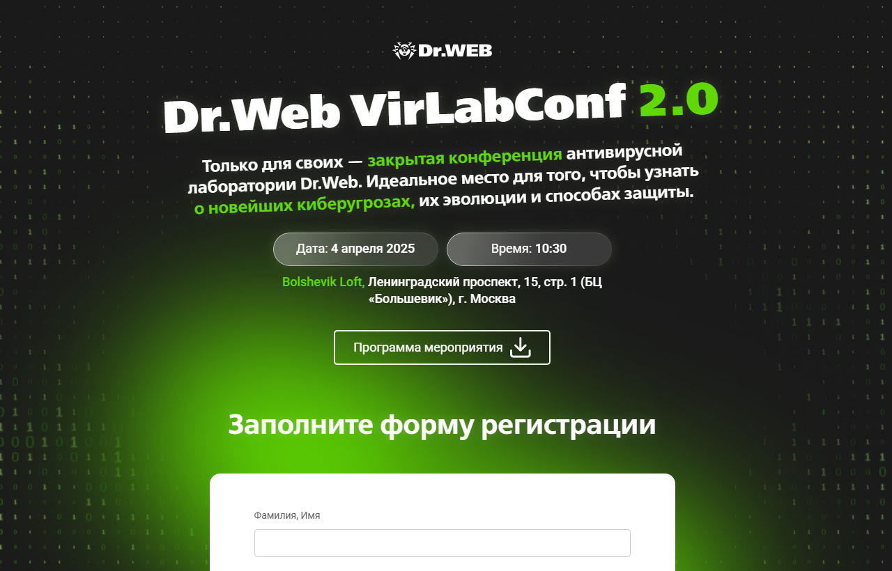

# Dr.Web VirLabConf 2.0

## 📌 О проекте

Адаптивная верстка лендинга для компании **Доктор Веб**.

Проект представляет собой одностраничный сайт с интерактивными элементами, формой регистрации и анимациями.

---

## 🚀 Технологии

* HTML5
* SCSS
* JavaScript (ES6+)
* Vite (сборка проекта)

---

## ✨ Функциональность

* 📱 Адаптивная верстка (поддержка разных устройств)
* 📝 Форма регистрации на мероприятие
* ✅ Валидация пользовательских данных
* 💬 Отображение модального окна с результатом отправки
* 🎨 Анимация фонового изображения
* 🔄 Анимация вращающихся DOM-элементов

---

## ⚙️ Установка и запуск

```bash
# Установка зависимостей
npm install

# Запуск в режиме разработки
npm run dev

# Сборка проекта
npm run build

# Превью сборки
npm run preview
```

---

## 📸 Превью



---

## 📎 Демо

👉 **[Live Demo](https://lab-conf.web.app)**

---

## 📬 Автор

©2026 Андрей Самойленко<br>
Все права защищены
